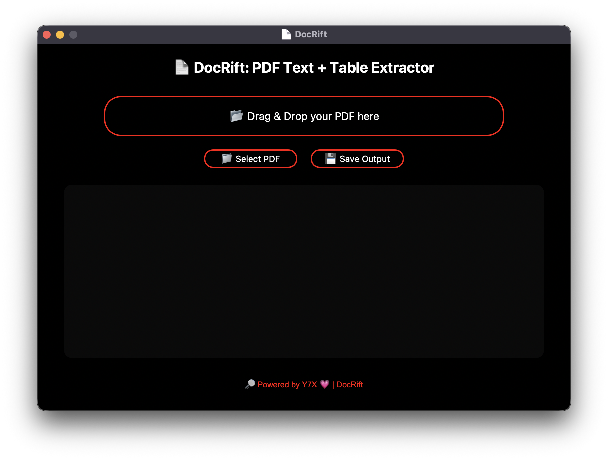

<div align="center">

# 🧠 DocRift
**🌌 Shattered the silence — DocRift now exists**

rack open any PDF and extract the juice – text, tables, and more.
💻 A sleek, glowing, AMOLED-style tool built for effortless PDF intelligence.
Branded with 💗 by [Y7X-bit](https://github.com/Y7X-bit)



</div>

---

## 🌟 Features at a Glance

- 📂 **Drag & Drop** your PDF directly into the app  
- 📋 **Extracts text + tables** using powerful `pdfplumber` engine  
- 🖤 **AMOLED UI** with red outlines & pill-shaped buttons  
- 💾 **Save results** to a clean `.txt` file  
- 🔎 **Y7X Signature Touch** with animated visuals and branding

---

## 🖥️ Installation

> Python 3.9 or later required

```bash
git clone https://github.com/Y7X-bit/DocRift.git
cd DocRift
pip install -r requirements.txt
python DocRift.py